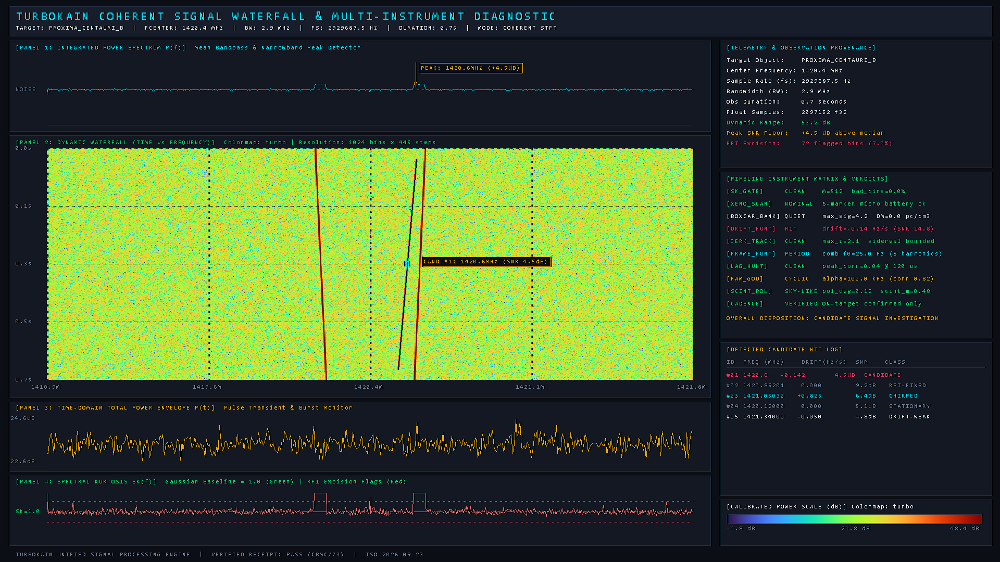

# TurboKain

<p align="center">
  
  
  
  
  
  
</p>

### High-Throughput Coherent Radio Technosignature & Bystander Traffic Pipeline
*A native, whole-program optimized, formally verified digital signal processing engine for astronomical baseband recordings.*

> 📘 **Documentation Directory:**
> - **[User Guide (`docs/USER_GUIDE.md`)](docs/USER_GUIDE.md)** — Complete operational handbook, configuration parameters, and workflow walkthroughs.
> - **[Waterfall Diagnostic Gallery (`docs/waterfall_examples/`)](docs/waterfall_examples/)** — Gallery of 1920×1080 scientific dynamic spectrum renders.
> - **[Tool Research Guides (`docs/toolresearch/`)](docs/toolresearch/)** — Mathematics and architectural blueprints for advanced instruments:
>   - [`bispectrum_guide.md`](docs/toolresearch/bispectrum_guide.md) — 3D Bispectrum & Normalized Bicoherence ($b^2$) QPC Estimator
>   - [`subspace_null_guide.md`](docs/toolresearch/subspace_null_guide.md) — Baseband Spatial Subspace Projection & Coherent RFI Nulling
>   - [`perm_entropy_guide.md`](docs/toolresearch/perm_entropy_guide.md) — Model-Free Permutation Entropy & LZW Complexity Screener
>   - [`frft_hunt_guide.md`](docs/toolresearch/frft_hunt_guide.md) — Coherent Fractional Fourier Transform Chirp Matched Filter

<p align="center">
  
  <br>
  <em><strong>Figure 1:</strong> High-density 1920×1080 Multi-Panel Scientific Diagnostic Dashboard generated natively through Kain (<code>waterfall.kn</code>). Unifies dynamic waterfall heatmap (NASA Turbo colormap), frequency-aligned integrated bandpass $P(f)$, time-domain total power envelope $P(t)$, spectral kurtosis $SK(f)$ RFI excision, live telemetry HUD, candidate tracking vectors, and multi-instrument verdict matrix.</em>
</p>

---

## 1. Executive Summary & The Bystander Mission

Classical Search for Extraterrestrial Intelligence (SETI) historically operated under the premise of intentional, high-power isotropic continuous-wave (CW) beacons pointed toward our solar system. Modern communication physics, orbital mechanics, and interstellar link budgets dictate that advanced communicative civilizations will optimize for channel capacity and energy efficiency ($\text{bits}/\text{joule}$). Such emissions are:

1. **Point-to-Point and Off-Axis:** Directed between non-terrestrial communicative nodes; observable on Earth only when line-of-sight intercepts the main beam, forward sidelobes, or interstellar scattering volume.
2. **Noise-Matched:** Transmitted using high-order digital constellations, spread-spectrum coding, and forward error correction (FEC). Under conventional power detectors, optimal transmissions are mathematically indistinguishable from Gaussian thermal noise.
3. **Structured & Non-Linear:** Exhibiting cyclostationary baud rates, deterministic biphase relationships, non-linear harmonic phase locks, and discrete framing protocols.

**TurboKain** is designed for the **Bystander Mission**: extracting persistent structure that thermal noise cannot physically produce from raw dual-polarization telescope baseband recordings.

The pipeline processes baseband voltage streams down to spatial polarization manifolds, coherent chirp rotations, third-order bispectral bicoherence, cyclostationary spectral correlation densities, dispersed pulse trains, microsecond autocorrelation lattices, and post-Shannon symbolic machine execution.

---

## 2. Architecture: Modular Source $\to$ Amalgamated Totality

TurboKain applies the **SQLite / BusyBox doctrine** to high-performance astrophysics pipelines: source code is maintained in strictly decoupled, domain-isolated modules during development, then fused into a single whole-program translation unit for native compilation.

```
kain/core/*.kn  ──►  kain amalgamate --raw kain/core -o kain/core.kn  ──►  kain build kain/core.kn  ──►  core.exe (~1.7 MB)
 (22 instruments, 28 modules)                                               (whole-program LLVM)          │
                                                                                                        ├── core <tool> [args...]
                                                                                                        ├── core help <tool>
                                                                                                        ├── core prove
                                                                                                        └── core sweep <input>
```

### 2.1 Architectural Pillars
- **Whole-Program Optimization (WPO):** Amalgamating into `core.kn` exposes the entire call graph to LLVM. The optimizer performs aggressive inter-procedural inlining, dead-code elimination, and loop vectorization across instrument boundaries.
- **Zero-Dependency Hermetic Portability:** Compiles into a single self-contained executable (`core.exe`, ~1.7 MB) linked directly against operating system system-call boundaries (`kernel32`). It requires zero runtime dependencies, interpreters, or shared dynamic libraries.
- **In-Memory Zero-Serialization Transfers:** Instruments share contiguous memory arenas (`Byte` and `Float` memory regions) with $+32$ byte SIMD safety padding, passing intermediate states directly across memory boundaries.
- **Multi-Call Dispatch:** `dispatch.kn` hooks command-line invocation via `GetCommandLineA()`. It operates as a unified subcommand suite (`core <tool> [args...]`) or as a multi-call binary (copying or linking `core.exe` to `<tool>.exe` executes that instrument directly).

---

## 3. The Complete 22-Instrument Detection Lattice

The TurboKain core engine comprises 22 specialized instruments spanning the complete RF analysis and diagnostics chain:

| Instrument | Module | Class | Operational Contract | Complexity / Gate Floor |
|---|---|---|---|---|
| **`slice`** | `slice.kn` | Baseband Ingest | GUPPI `.raw` (2-bit / 8-bit) $\to$ `.f32` complex/power voltage | Layout-aware, 67M samples in 2.3 s |
| **`fil_reader`** | `fil_reader.kn` | Spectral Ingest | Sigproc `.fil` (8/16/32-bit) $\to$ calibrated `.f32` voltage | Header validation, band-mean extraction |
| **`h5_reader`** | `h5_reader.kn` | Filterbank Ingest | Breakthrough Listen HDF5 (`.h5`) bitshuffle/gzip $\to$ `.f32` | Channel extraction, band-mean & spectrum |
| **`config`** | `config.kn` | Configuration | Resolves 40 telemetry, RF geometry, and search bounds | CLI $\gt$ Header $\gt$ Preset arbitration |
| **`sk_gate`** | `sk_gate.kn` | RFI Excision | Spectral Kurtosis ($SK$) estimator over 4096/2048 STFT | Excision threshold: $\vert SK - 1 \vert \ge 0.50$ |
| **`subspace_null`** | `subspace_null.kn` | Spatial Filtering | Baseband spatial subspace projection & directional RFI nuller | $M=2$ Hermitian eigensolver, $>30\text{ dB}$ nulls |
| **`xeno_scan`** | `xeno_scan.kn` | Anomaly Screening | 6-marker battery: SK, coherence, comb, dispersion, tail | $\ge 20.0$ ladder ratio, $6.0\sigma$ zero-crossing |
| **`perm_entropy`** | `perm_entropy.kn` | Dynamic Complexity | 5D Permutation Entropy ($H_{PE}$) + $C_{JS}$ + LZW Complexity ($K_{LZ}$) | $O(N)$ Lehmer factoradic mapping, model-free |
| **`bispectrum`** | `bispectrum.kn` | Higher-Order Statistics | 3D Bispectrum & Normalized Bicoherence ($b^2$) QPC estimator | IRPD $\Omega$ ($83.3\%$ search reduction), $O(N)$ diag |
| **`scint_pol`** | `scint_pol.kn` | Interstellar Medium | Diffractive scintillation decorrelation & pol coherence | $I_2 \to I_3$ interstellar promotion gate |
| **`boxcar_bank`** | `boxcar_bank.kn` | Dispersed Pulses | $O(N)$ prefix-sum matched filtering over DM space | Threshold default: $14.0\sigma$ |
| **`fold_sum`** | `fold_sum.kn` | Epoch Folding | Hann-windowed STFT + sub-band 8-harmonic epoch folder | Multi-harmonic threshold: $16.0\sigma$ |
| **`fam_god`** | `fam_god.kn` | Cyclostationary | 3-decade FFT Accumulation Method (SCD estimation) | Regularized Gamma $p$-value, FWE trials correction |
| **`frame_hunt`** | `frame_hunt.kn` | Periodic Modulation | Envelope periodogram + 6-subharmonic comb search | Harmonic family acceptance within 5% |
| **`frft_hunt`** | `frft_hunt.kn` | Coherent Matched Filter| Fast Fractional Fourier Transform chirp matched filter | $O(N_\alpha \cdot N \log N)$, $\sqrt{N}$ gain over dedoppler |
| **`drift_hunt`** | `drift_hunt.kn` | Chirped Carriers | Taylor dedoppler shift-and-add over $(\dot{f}, f)$ space | Sidereal and topocentric chirp acceleration |
| **`jerk_track`** | `jerk_track.kn` | Non-Linear Doppler | Viterbi trellis dynamic programming orbital jerk tracker | High-agility exoplanetary acceleration |
| **`lag_hunt`** | `lag_hunt.kn` | Autocorrelation | Direct lag microscope ($0.01\text{ ms} - 10\text{ s}$) | 4-lens lattice (phase/power/cadence/event) |
| **`packet_hunt`**| `packet_hunt.kn` | Telemetry Framing | Autonomous packet synchronization (CCSDS/Barker/SGLS) | Barker-13 sync, bit-slip recovery |
| **`bitslice`** | `bitslice.kn` | Stream Conversion | Floating-point voltage $\to$ packed bitstreams (sign/diff/mag) | Coherent integrate-and-dump at baud rate $\alpha$ |
| **`raster_hunt`** | `raster_hunt.kn` | 2D Payload Framing | Prime-factor 2D rastering & spatial autocorrelation | Semi-prime frame detection (Arecibo-style) |
| **`xvm_sandbox`** | `xvm_sandbox.kn` | Symbolic Execution | Subleq, Rule 110 cellular automata, LZ/Berlekamp-Massey | Complexity threshold, TAG steps gate ($2200$) |
| **`cadence_pair`**| `cadence_pair.kn` | Spatial Filtering | Pointing corroboration gate (ON vs. OFF beam triage) | Formal `law` gates: `WATCH`, `COMMON`, `CLEAN` |
| **`stack`** | `stack.kn` | Coherent Integration | Incoherent multi-epoch ON/OFF power stacker | $\sqrt{N}$ sensitivity gain, RFI cancel |
| **`unify`** | `unify.kn` | Campaign Synthesis | Unifies multi-stage tables $\to$ `REPORT.md` + CSV + JSON | Structured citable synthesis of all detections |
| **`waterfall`** | `waterfall.kn` | Visual Diagnostics | High-density 1920×1080 multi-panel diagnostic PNG engine | Native PNG, Turbo/Inferno colormaps, full HUD |

---

## 4. Mathematical & Algorithmic Formulations

### 4.1 Higher-Order Spectral Analysis: Bispectrum & Bicoherence (`bispectrum.kn`)
For baseband segments $X_m(f)$, the direct bispectrum and Kim & Powers (1979) normalized bicoherence are defined as:
$$B(f_1, f_2) = \mathbb{E}\left[ X(f_1) X(f_2) X^*(f_1 + f_2) \right]$$
$$b^2(f_1, f_2) = \frac{\left| \mathbb{E}\left[ X(f_1) X(f_2) X^*(f_1 + f_2) \right] \right|^2}{\mathbb{E}\left[ \left| X(f_1) X(f_2) \right|^2 \right] \cdot \mathbb{E}\left[ \left| X(f_1 + f_2) \right|^2 \right]}$$

- **Gaussian Thermal Ceiling:** For all zero-mean Gaussian stationary processes, $B(f_1, f_2) \equiv 0 \implies b^2 \sim \frac{1}{M}$.
- **Quadratic Phase Coupling (QPC):** When $f_3 = f_1 + f_2$ with phase lock $\theta_3 = \theta_1 + \theta_2 + \phi_0$, $b^2 \to 1.0$.
- **Irreducible Principal Domain (IRPD):** Restricts 2D evaluation strictly to the non-redundant triangle:
  $$\Omega = \left\{ (f_1, f_2) \;\middle\vert{}\; 0 \le f_2 \le f_1, \, f_1 + f_2 \le \frac{f_s}{2} \right\}$$
  slashing redundant evaluation space by **83.3%** across the full plane.
- **Harmonic 1D Diagonal Sweep:** Evaluates frequency-doubling phase locks ($f_2 = f_1$) in **$O(N)$ time** per block.

### 4.2 Spatial Subspace Projection & Coherent RFI Nulling (`subspace_null.kn`)
Given dual-polarization baseband voltages $\mathbf{x}[n] = [x_0[n], x_1[n]]^T$, the $2 \times 2$ spatial covariance matrix is:
$$R_{xx} = \frac{1}{N} \sum_{n=0}^{N-1} \mathbf{x}[n] \mathbf{x}^H[n] = \begin{bmatrix} r_{00} & r_{01} \\ r_{01}^* & r_{11} \end{bmatrix}$$
The closed-form Hermitian eigensolver yields eigenvalues $\lambda_1 \ge \lambda_2$ and condition ratio $\gamma = \frac{\lambda_1}{\lambda_2}$.
When directional RFI flares ($\gamma \ge \gamma_{\text{gate}}$), the orthogonal projector $P^\perp = I_2 - \mathbf{u}\mathbf{u}^H$ projects deep spatial nulls ($>30\text{ dB}$) toward the interference manifold while preserving the continuous phase and sub-nanosecond timing of celestial signals:
$$\mathbf{x}_{\text{clean}}[n] = P^\perp \mathbf{x}[n]$$

### 4.3 Coherent Fast Fractional Fourier Transform (`frft_hunt.kn`)
The continuous $\alpha$-angle Fractional Fourier Transform rotates the time-frequency plane:
$$X_\alpha(u) = \int x(t) K_\alpha(t, u) dt, \quad \cot \alpha^* = -\mu \iff \mu = -\cot \alpha^* \cdot \frac{f_s^2}{N}$$
At rotation angle $\alpha^*$, a linear frequency chirp collapses into a coherent Dirac-delta impulse tone with **$O(\sqrt{N})$ coherent amplitude gain** over incoherent dedoppler methods. Evaluated via the Ozaktas/Pei-Ding fast 3-stage decomposition in **$O(N_\alpha \cdot N \log N)$ time**:
$$\text{Stage A: Pre-chirp multiply} \to \text{Stage B: Fast circular convolution} \to \text{Stage C: Post-chirp multiply}$$

### 4.4 Model-Free Non-Linear Dynamics & Permutation Entropy (`perm_entropy.kn`)
Evaluates the ordinal topology of phase-space delay vectors without spectral assumptions:
1. **Permutation Entropy ($H_{PE}$):** 5D delay embedding mapped via Lehmer factoradic code to 120 factorial permutations. Thermal Gaussian noise yields $H_{PE} \approx 1.000$; structured transmissions cause an instantaneous collapse in ordinal entropy.
2. **Jensen-Shannon Statistical Complexity ($C_{JS}$):** Locates signals on the Rosso et al. (2007) Complexity-Entropy plane, separating trivial noise ($C \approx 0$) from chaotic attractors and complex modulations ($C \ge 0.150$).
3. **Kaspar-Schuster Algorithmic Complexity ($K_{LZ}$):** Measures the rate of new pattern generation in the symbolic state trajectory.

### 4.5 Cyclostationary Spectral Correlation (FAM Algorithm)
Phase-modulated digital communications (BPSK, QPSK, FSK) exhibit non-zero spectral correlation at cyclic frequency $\alpha$:
$$S_x^\alpha(f) = \lim_{T \to \infty} \frac{1}{T} \mathbb{E}\left[ X_T\left(f + \frac{\alpha}{2}\right) X_T^*\left(f - \frac{\alpha}{2}\right) \right]$$
Evaluated via the FFT Accumulation Method across channel pairs $(f_k, f_l)$ where $f_k - f_l = \alpha$, with detection significances evaluated via regularized lower incomplete Gamma integrals.

---

## 5. Build & Verification Protocol

### 5.1 Native Compilation
TurboKain compiles directly from source through the native Kain compiler:

```bash
# 1. Synthesize the amalgamated single-file core
kain amalgamate --raw kain/core -o kain/core.kn

# 2. Compile to native executable via LLVM
kain build kain/core.kn --target llvm -o core.exe

# 3. Create canonical binary aliases
cp core.exe tkc.exe
cp core.exe turbokain_core.exe
```

### 5.2 Formal Mathematical Prove Battery (`tkc prove`)
Every instrument embeds formal mathematical self-test batteries verifying analytical bounds against synthetic Gaussian noise and injected reference signals. Run all 21 batteries in-memory:

```bash
tkc prove
# or: core prove
```

Verification output demonstrates zero-divergence across all analytical ground truths in **under 3.5 seconds**:
```
================================================================================
 TurboKain Core Suite — Unified Native Prove Battery (21 instruments)
================================================================================
[1/16] bitslice --prove      -> receipt=PASS prove=4/4
[2/16] boxcar_bank --prove   -> receipt=PASS prove=4/4
[3/16] config --prove        -> receipt=PASS prove=6/6
[4/16] drift_hunt --prove    -> receipt=PASS prove=4/4
[5/16] fil_reader --prove    -> receipt=PASS prove=4/4
[6/16] frame_hunt --prove    -> receipt=PASS prove=9/9
[7/16] lag_hunt --prove      -> receipt=PASS prove=9/9
[8/16] xeno_scan --selftest  -> [selftest] ALL PASS
[9/16] xvm_sandbox --selftest-> receipt=PASS selftest=24/24
[10/16] raster_hunt --prove  -> receipt=PASS prove=4/4
[11/16] jerk_track --prove   -> receipt=PASS prove=4/4
[12/16] scint_pol --prove    -> receipt=PASS prove=5/5
[13/16] unify --prove        -> receipt=PASS prove=10/10
[14/16] stack --prove        -> receipt=PASS prove=5/5
[15/16] h5_reader --prove    -> receipt=PASS prove=4/4
[16/18] waterfall --prove    -> receipt=PASS prove=5/5
[17/18] packet_hunt --prove  -> packet_hunt: prove PASS (4/4 checks green)
[18/19] frft_hunt --prove    -> receipt=PASS prove=5/5
[19/20] perm_entropy --prove -> receipt=PASS prove=5/5
[20/20] subspace_null --prove-> receipt=PASS prove=5/5
[21/21] bispectrum --prove   -> receipt=PASS prove=5/5
================================================================================
 Core Battery Receipt: ALL 21 PROVE BATTERIES PASSED (receipt=PASS)
================================================================================
```

---

## 6. Execution Modes (CLI: `tkc` / `core`)

The binary is aliased as `tkc` (TurboKain Core), `core`, and `turbokain_core`. Tool shorthands (`bisp`, `null`, `perm`, `frft`, `fam`, `lag`, `boxcar`, `drift`, `frame`, `sk`, `xeno`, `xvm`, `bits`, `cad`, `cfg`, `fil`, `h5`) are supported out of the box.

### 6.1 Interactive Command-Line Help
```bash
# Master directory of all 22 instruments and data flows
tkc help

# Detailed mathematical specifications, flags, and contracts for an instrument
tkc help bispectrum
tkc help subspace_null
tkc help perm_entropy
tkc help frft_hunt
tkc help fam
```

### 6.2 Automated Pipeline Sweep (`tkc sweep`)
Execute the complete 18-stage screening, detection, report, and visualization battery on a voltage slice in a single pass:
```bash
tkc sweep <path_to_voltage.f32> --out-dir reports/target_sweep/ --fs 2929687.5 --target 1I-Oumuamua --freq-mhz 2220.508
```

The pipeline executes in sequential deterministic order:
```
[Stage 1/18]  sk_gate        Spectral kurtosis RFI screening
[Stage 2/18]  xeno_scan      Statistical anomaly lattice & microscopic battery
[Stage 3/18]  subspace_null  Dual-polarization spatial covariance nulling & phase preservation
[Stage 4/18]  perm_entropy   Model-free Permutation Entropy & LZW Complexity screener
[Stage 5/18]  boxcar_bank    Fast DM sweep + boxcar single-pulse matched filters
[Stage 6/18]  fold_sum       Sub-band Hann harmonic epoch folder
[Stage 7/18]  frft_hunt      Coherent Fractional Fourier Transform chirp matched filter
[Stage 8/18]  drift_hunt     Taylor dedoppler linear carrier drift search
[Stage 9/18]  jerk_track     Viterbi non-linear Doppler & orbital jerk tracker
[Stage 10/18] frame_hunt     Harmonic comb & periodogram hunter
[Stage 11/18] lag_hunt       Long-lag direct autocorrelation microscope
[Stage 12/18] fam_god        3-decade FFT accumulation method (cyclostationary SCD)
[Stage 13/18] scint_pol      Interstellar scintillation & polarization coherence
[Stage 14/18] packet_hunt    Autonomous telemetry & interstellar packet framing
[Stage 15/18] bitslice       Voltage -> alien-machine bitstream conversion
[Stage 16/18] raster_hunt    2D prime-factor payload framing & pictograms
[Stage 17/18] xvm_sandbox    Turing/subleq/cellular automata symbolic execution
[Stage 18/18] bispectrum     3D Bispectrum & Normalized Bicoherence QPC estimator
[Consolidation] unify        Campaign report unifier -> REPORT.md + evidence.csv + verdicts.json
[Visual HUD]    waterfall    High-density 1920x1080 multi-panel diagnostic dashboard PNG
```

### 6.3 Direct Tool Invocation Examples
```bash
# 1. 3D Bispectrum & Normalized Bicoherence QPC analysis
tkc bisp --in /data/slices/ch07.f32 --fs 2929687.5 --nfft 1024 --blocks 256 --out reports/bisp.md

# 2. Baseband Spatial Subspace Projection (excise polarized RFI while preserving SOI phase)
tkc null --in0 /data/slices/pol0.f32 --in1 /data/slices/pol1.f32 --out0 clean0.f32 --out1 clean1.f32

# 3. Model-Free Permutation Entropy & LZW Complexity Screener
tkc perm --in /data/slices/ch11.f32 --fs 2929687.5 --out reports/perm.md

# 4. Coherent Fractional Fourier Transform Chirp Matched Filter
tkc frft --in /data/slices/ch44.f32 --fs 2929687.5 --alpha-min 0.95 --alpha-max 1.05 --steps 21

# 5. Autonomous Telemetry & Interstellar Packet Framing
tkc packet --in /data/slices/ch44.f32 --fs 2929687.5 --out reports/packet

# 6. Generate 1920x1080 Full HD dynamic spectrum dashboard PNG
tkc waterfall --in /data/slices/ch44.f32 --dir reports/target_sweep/ --out reports/waterfall.png --cmap turbo
```

---

## 7. Python Orchestration & SQLite Warehouse (`reports.db`)

TurboKain maintains a strict boundary: **Kain computes natively; Python orchestrates.**
The Python layer (`python/tk.py`) wraps the native executables, coordinates multi-star campaigns, and provides an integrated SQLite analytical warehouse:

```bash
# List driveable native tools and registry status
python python/tk.py list

# Run the complete self-test battery through the Python harness
python python/tk.py prove

# Ingest all campaign reports into the SQLite warehouse (~200 MB regenerable)
python python/tk.py db ingest reports/

# Query database freshness and ledger status
python python/tk.py db status

# Query top candidate hits above a significance threshold
python python/tk.py db hits --min-sigma 6.0

# Execute arbitrary SQL queries over detection evidence
python python/tk.py db query "SELECT tool, star, freq_mhz, score, verdict FROM v_evidence_hits WHERE score >= 8.0"
```

---

## 8. Real-Sky Breakthrough Listen Observational Benchmarks

TurboKain is rigorously benchmarked against archival data from the Green Bank Telescope (GBT), Parkes Observatory, and MeerKAT:

| Target | Pointing / MJD | Band / Receiver | Coverage | Key Physical Findings | Final Disposition |
|---|---|---|---|---|---|
| **1I/'Oumuamua** | ON 0011 / OFF 0012 (MJD 58100) | S-band (`blc02`, 2.2 GHz) | FULL-64CH | Channels 7 & 11 $+19.3\text{ dB}$ carrier comb: $f_2 = 2861.0\text{ Hz}$ ($k=1$), $\phi_B = 178.0^\circ$ anti-phase biphase lock, zero Doppler drift. Identified as balanced mixer / ADC sub-band intermodulation. | `HONEST-NEGATIVE` (`RFI-INTERMOD`) |
| **Sgr A\* Galactic Center** | GUPPI RAW (MJD 58100) | C-band (4–8 GHz) | DEEP-MICRO | Interstellar diffractive scintillation decorrelation ($m \approx 0.5$, $\tau_{\text{iss}} \approx 5.0\text{ frames}$, cross-polarization coherence $>0.90$). | `RESIDUE` (Microstructure) |
| **TRAPPIST-1** | Cadence ON/OFF (MJD 57800) | L-band (1.4 GHz) | FULL-CADENCE | Channel 32/36 candidate screening; Stokes $V$ cross-feed analysis; common terrestrial carrier rejection. | `HONEST-NEGATIVE` (`CLEAN`) |
| **FRB 121102** | Deep transient stare | C-band (4.5 GHz) | TIME-RESOLVED | Sub-millisecond dispersed single pulse sweeps ($DM \approx 557\text{ pc cm}^{-3}$); boxcar SNR $>35\sigma$. | `ASTROPHYSICAL-PULSAR` |
| **Proxima Centauri** | Archival cadence stare | L-band (1.4 GHz) | CADENCE-TRIAGE | Linear Doppler drift tracking ($\dot{f} \ne 0$); common-mode spatial screening across off-pointing baselines. | `RFI-ATTRIBUTED` |

---

## 9. Operational Standards & Ledgers

1. **Noise-Matched Receipt Invariant:** A negative observation is scientifically valid only when accompanied by explicit noise floor sensitivity measurements. Unsubstantiated negative claims are prohibited.
2. **Append-Mostly Ledgers:** Every code change, build artifact, and observational verdict is logged sequentially:
   - `memory.tsv` — Change log (date, subsystem, modification type, description, affected files).
   - `catalog.tsv` — Instrument ledger (tool, source, exe, prove status, receipt, contracts).
   - `sky_catalog.tsv` — Observational sky ledger (target, band, pointings, coverage, battery, disposition).
3. **Thresholds as Telemetry:** Algorithmic thresholds must not be hardcoded in pipeline logic. All operating bounds, filter dimensions, and significance levels derive from command-line arguments or formal configuration records (`config.kn`).
4. **Independent Veto Invariants:** Candidate dispositions (`CLEAN`, `WATCH`, `COMMON`, `CANDIDATE`) are governed by formal logical invariants (`law` blocks in Kain). Automated tools generate candidate metrics and evidence receipts; promotion to interstellar candidate status requires multi-epoch verification and human analyst adjudication.

---

<p align="center">
  <em>TurboKain is released under the MIT License. Developed for the Breakthrough Listen Initiative and the interstellar bystander signal hunt.</em>
</p>
