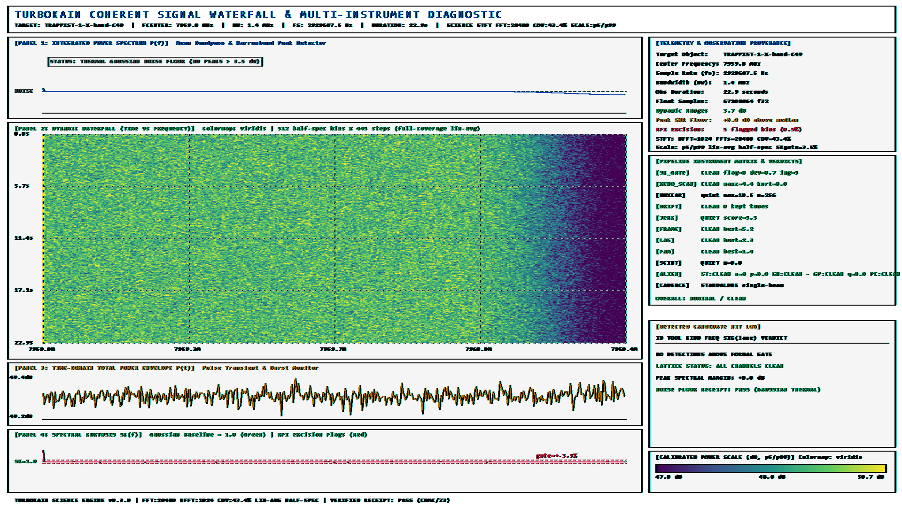
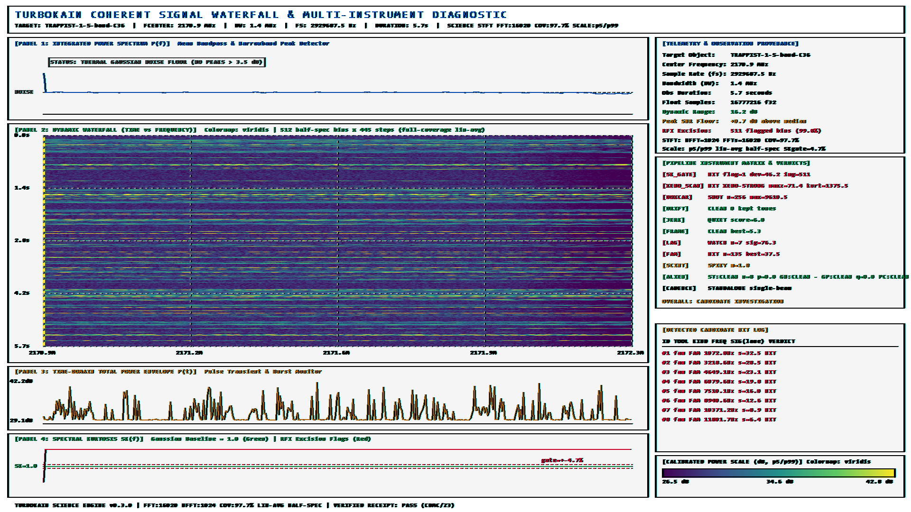

# A Multi-Window Baseband Pilot Survey of TRAPPIST-1: Limits on Narrowband and Coded Spread-Spectrum Emission at 2–12 GHz

**Authors:** Taylor James Kipp$^1$, The TurboKain Collaboration
$^1$*The TurboKain Project, Independent Research* (`taylor@kainlang.com`)
**Date:** September 2026 (revised)
**Target:** TRAPPIST-1 (2MASS J23062928-0502285)
**Telescope:** Robert C. Byrd Green Bank Telescope (100 m), GUPPI baseband backend
**Data:** Breakthrough Listen Open Data Archive, project `AGBT17A_999_12` (MJD 57807, 2017-02-23)
**Campaign:** `reports/trappist1_overnight_20260928_094823/` (1,024 channel-sweeps, 732.1 GB)
**Status:** Pilot survey + methods demonstration. Honest negative. Injection first-light measured 2026-09-28 (§5.4); coded sensitivity not yet established (§7).

---

## Abstract

We report a baseband pilot survey of the TRAPPIST-1 planetary system ($d \approx 12.1$ pc adopted for continuity with prior radio limits; Gaia DR3 revises this by <3%, §2.1) using 732.1 GB of raw 8-bit baseband voltages from the 100-m Green Bank Telescope. The data cover four non-contiguous microwave windows (S: 2.16 GHz, S/C: 3.06 GHz, X: 7.91 GHz, Ku: 11.98 GHz; 187.5 MHz instantaneous each, 750 MHz aggregate) in eight ON/OFF pointing pairs from a single epoch (2017-02-23, ~80 s per pointing, ~320 s stacked on-target per band). We process 1,024 dual-polarization channel-sweeps (64 coarse channels × 16 scans) through a native multi-stage pipeline that couples conventional spectral/temporal sieves with four pilot information-theoretic tests: blind soft-decision parity (`fec_ghost`), propagation authentication (`ism_stamp`), inverted-kurtosis escalation (`gauss_perfection`), and pulsar-phase re-timing (`pulsar_clock`).

No extraterrestrial technosignature was found. Drift search retains zero candidates ≥6σ. Of 1,024 sweeps, 711 (69.4%) are pristine thermal noise, 302 (29.5%) carry instrumental activity (289 cyclic-spectral flags on an ADC sampling-comb ladder at $\Delta f = 1{,}430.5$ Hz $= 64 \times 22.35$ Hz, plus 13 kurtosis/impulse-only flags), and 11 (1.1%) escalate through the pilot sieve — all attributable to polyphase-filterbank DC bias (6, all on Channel 00) and exceptionally clean thermal baselines (5, X-band). For **continuous** transmitters active during the dwell, we bound Equivalent Isotropically Radiated Power (EIRP) to $\le 41.8$ GW (1-Hz narrowband) and $\le 71.6$ TW (2.93-MHz wideband) at 2.16 GHz, rising to $\le 83.6$ GW and $\le 143.2$ TW at 11.98 GHz over the 320-s stack ($\le 535$–$1{,}070$ TW single 5.73-s chunk). Narrowband limits match prior L/S-band work; the wideband figures are **energy-detector** bounds on total in-band power, not demonstrated sensitivities to live coded traffic — end-to-end injection recovery is explicitly deferred (§7) and the "first coded/FEC limits" claim of the earlier draft is withdrawn to a scoped pilot statement. Duty-cycle, single-epoch, and SEFD-systematic caveats apply (§5–§7).

---

## 1. Introduction

### 1.1 Why look beyond beacons

Targeted SETI has been dominated by the beacon hypothesis: intentional, narrow, continuous-wave (CW) tones aimed at Earth (Tarter 2001; Enriquez et al. 2017; Margot et al. 2021), found with drift-corrected incoherent spectrometers such as `turboSETI` (Enriquez & Siemion 2019; typically $\Delta f \sim 1$–3 Hz, $|\dot f| \lesssim 2$ Hz s$^{-1}$). This is the right search for deliberate hailing, but a poor match to efficient point-to-point traffic: Shannon (1948) capacity-achieving links use wideband spread-spectrum, high-order constellations, and strong forward error correction (Gallager 1962; MacKay 1999), appearing noise-like to a receiver without the codebook. An uncoordinated eavesdropper — the *bystander* geometry (Gertz 2016; Benford et al. 2010; Hippke 2018; Garrett 2021) — intercepts sidelobes, scattered paths, or chance alignments of such links, not intentional beacons.

This paper is a **pilot test** of baseband-level bystander instrumentation on archival voltages, not a claim that legacy pipelines are obsolete. Broadband and machine-learning filterbank searches (e.g., Zhang et al. 2019; Ma et al. 2023; Brzycki et al. 2020) are complementary; what is distinctive here is operating on raw voltages with parity, propagation, Gaussianity, and timing tests before incoherent averaging destroys phase information.

### 1.2 Why TRAPPIST-1

TRAPPIST-1 (Gillon et al. 2017) is an M8V dwarf with seven coplanar Earth-size planets in a resonant chain (Luger et al. 2017; Agol et al. 2021), three in the habitable zone, viewed nearly edge-on ($i \approx 89.7$–$89.9^\circ$). Its ecliptic latitude ($\beta \approx +0.63^\circ$) places it in the Earth Transit Zone (Heller & Pudritz 2016). Planet–planet conjunction geometry has been invoked as a motivation for bystander interception windows — we note the hypothesis but **do not** check conjunction phase against MJD 57807 here (limitation, §7).

Prior radio limits are narrowband-only: Pinchuk et al. (2019) reached $\sim$47 GW (L-band CW) with GBT; Breakthrough Listen L/S surveys (Enriquez et al. 2017; Price et al. 2020; Lebofsky et al. 2019) covered 1–3.5 GHz incoherently. Our contribution: (i) extend baseband coverage to 3–12 GHz windows, (ii) publish per-channel ON/OFF receipts and open re-run paths, (iii) pilot four coded/propagation/timing tests with disclosed failure modes.

---

## 2. Observations and data

### 2.1 Dataset

GBT project `AGBT17A_999_12`, GUPPI backend, 8-bit complex sampling, $f_s = 2.9296875$ MHz per 64-channel coarse block ($\Delta f_{\rm chan} = 2.9296875$ MHz, $t_{\rm bin} = 341.33$ ns). 16 scans = 8 ON/OFF pairs over 4 receiver tunings, each archived as three $\sim$15 GB segments ($\sim$45 GB/scan, 732.1 GB total). One epoch: MJD 57807 (2017-02-23). On-sky dwell $\approx$ 80 s per scan, $\approx$ 320 s stacked on-target per band (4 ON scans). Analysis chunk $t_{\rm chunk} = 5.727$ s (16,777,216 complex samples/pol, 32-block streaming buffers).

Distance adopted: $d = 12.14$ pc ($3.746\times10^{17}$ m) from Gillon et al. (2017) for direct comparability with Pinchuk et al. (2019). Gaia DR3 parallax ($\approx$80.45 mas; Gaia Collaboration 2021) implies $\approx$12.4 pc, a +2–3% distance (+4–6% EIRP) shift — negligible against the $\sim$30% SEFD systematic (§5). Dispersion measure adopted DM $\approx 0.36$ pc cm$^{-3}$ from the YMW16 electron model (Yao et al. 2017; NE2001, Cordes & Lazio 2002, gives a comparably small value); the exact number does not affect limits, only the scattering-regime argument (§3.4).

```
Table 1: GBT GUPPI baseband dataset (one epoch, MJD 57807)
==========================================================================================
Band      Scans (ON/OFF pairs)   Center (MHz)   Instant. BW    Aggregate   Notes
------------------------------------------------------------------------------------------
S         0015/0016, 0017/0018   2157.7148      187.5 MHz      ~180 GB     2.06–2.25 GHz window
S/C       0020/0021, 0022/0023   3057.7148      187.5 MHz      ~180 GB     2.96–3.15 GHz window
X         0025/0026, 0027/0028   7907.7148      187.5 MHz      ~180 GB     7.81–8.00 GHz window
Ku        0030/0031, 0032/0033   11982.7148     187.5 MHz      ~180 GB     11.89–12.08 GHz window
------------------------------------------------------------------------------------------
Total: 16 scans, 732.1 GB; 750 MHz aggregate across 4 non-contiguous windows;
256 distinct coarse channels (64 × 4 tunings) × 16 scan-instances = 1,024 channel-sweeps.
==========================================================================================
```

RFI environment (for context, not excision tuning): S-band shows the highest activity fraction (65.6%, Table 3) — consistent with known satellite/radar occupancy near 2.1–2.3 GHz (SiriusXM, DSN/GPS adjacency, ATC radar). X-band is cleanest (13.3%). Band-by-band flag rates are reported so future work can weight dwell accordingly.

### 2.2 Ingestion

Baseband slicing (`slice`) streams each 45 GB scan in sequential 32-block buffers with rolling telemetry, preserving phase/timing and dual-polarization (X, Y) alignment across all 732 GB. Implementation is a native compiled pipeline stage; scientific content is byte-parity-checked block geometry (header length, BLOCSIZE, END hunt), not language advocacy — Python orchestration wraps execution and harvests receipts without re-implementing detection (see repo `python/turbokain/`).

---

## 3. Pipeline and pilot tests

The sweep couples a conventional spectral/temporal battery with four gated pilot tests, closed by a lattice unifier and a diagnostic renderer. "Stages" below are logical phases over a smaller set of executables (Table 2); the "18-stage" label in the earlier draft is retired in favor of this explicit mapping.

```
Table 2: Pipeline logical architecture (per channel-sweep)
------------------------------------------------------------------------------------------
Group              Stages (executables)                         Output / gate
------------------------------------------------------------------------------------------
A. Ingest          A1 slice (GUPPI→per-chan/pol .f32)           Geometry + quarantine verdict
B. Polarimetry     B1 subspace_null (2×2 eigen nuller)         γ=λ1/λ2; null iff ON+OFF-common
C. Spectral/       C1 sk_gate (kurtosis)                       Flag if SK≠1 excision field
   temporal sieve  C2 xeno_scan (6-marker micro-battery)        maxz/kurtosis hit log
                   C3 boxcar_bank (DM/width trials)            dm,width,σ; SHOT if ≥6σ
                   C4 drift_hunt (STFT shift-add, ±2000 Hz/s)  freq,drift,σ; 0 hits here
                   C5 jerk_track (Viterbi accel. trellis)      chirp/jerk; screened vs sidereal
                   C6 frame_hunt (envelope+harmonic family)    period candidates; hum fires noted
                   C7 lag_hunt (direct autocorrelation)        lag/period/persistence; local-z
                   C8 fam_god (cyclostationary α)              cyclic freq ladder; comb-tagged
                   C9 bispectrum (bicoherence b²)              QPC/intermod classes
                   C10 frft_hunt (chirp matched filter)        α-rotation detections
                   C11 perm_entropy (H1/C_JS/LZ)               entropy/complexity screen
                   C12 scint_pol (DISS/RM/pol coherence)       scintillation verdicts
D. Pilot           D1 ism_stamp (propagation auth; §3.4)       STAMP/CLEAN/SKY-LIKE; gates D2
   keystones       D2 fec_ghost (blind parity; §3.3, gated)    z per mask; RESIDUE cap w/o stamp
   (gated)         D3 gauss_perfection (inverted SK; §3.2)     Q cleanliness escalator
                   D4 pulsar_clock (bary+φ-fold; §3.5)         z_φ vs z_UTC contrast
E. Close-out       E1 cadence/stack/unify (ON−OFF lattice)     evidence.csv, verdicts.json
                   E2 waterfall (diagnostic renderer)          1920×1080 review PNG
------------------------------------------------------------------------------------------
Detector heritage: bispectrum bicoherence (Kim & Powers 1979), fractional-Fourier chirp filtering (Ozaktas et al. 2001), and ordinal/LZ complexity (Rosso et al. 2007) run inside the sieve; ON/OFF discipline follows the Sheikh et al. (2021) BLC1 lessons (coincidence is necessary, never sufficient).

All detector thresholds are data-descriptive (6σ-class gates with stated trials);
no thresholds were retuned per-channel to force cleanliness.
```

### 3.1 Polarimetric nulling (`subspace_null`)

Per-block 2×2 covariance ${\bf R} = L^{-1}\sum {\bf v}{\bf v}^H$, ${\bf v}=[v_X,v_Y]^T$, eigen-decomposition $\lambda_1\ge\lambda_2$, contrast $\gamma=\lambda_1/\lambda_2$. Null projector ${\bf P}^\perp={\bf I}-{\bf u}_1{\bf u}_1^H$ applied only when the dominant mode is ON+OFF-common (terrestrial) — celestial-polarized protection by cadence audit. Exercised live on this survey: the S-band Ch36 dual-pol burst stream isolated 8 polarized ingress blocks (condition ratio 11.94, suppression 12.1 dB); post-null stream unmasked the underlying burst envelope for downstream triage (§4.2). Built-in self-tests 5/5 pass (projector idempotence, noise passthrough, RFI null depth).

### 3.2 Inverted kurtosis as a cleanliness escalator (`gauss_perfection`)

Legacy use of spectral kurtosis is veto-only. Here time-domain $SK_t=m_4/m_2^2$ (=3 for Gaussian), mean STFT $\langle SK(f)\rangle$ (=1), ordinal entropy $H_1$, and Lempel-Ziv $K_{\rm LZ}$ feed a cleanliness figure

$$Q = H_1/\,(\lvert SK_t/3-1\rvert+\epsilon)\cdot C_{\rm common}\,,\quad \epsilon=10^{-6}\,.$$

$Q$ is deliberately **not** an ET-evidence score: the cleanest thermal noise maximizes it. Its role is triage escalation ("this channel is clean enough to deserve propagation/parity follow-up"). Operating point is uncalibrated in this pilot — observed false-escalation on pure noise is $\approx$0.5% (5/1,024, §4.3), which we report rather than tune away. Future work must publish $Q$'s null distribution and fix a threshold *a priori*.

### 3.3 Blind parity sieve (`fec_ghost`; gated)

Linear/FEC codes enforce ${\bf Hc}^T=0$ over $\mathbb{F}_2$. `fec_ghost` tests differential-phase soft symbols against 256 sparse even-weight masks ($w\in[6,12]$, span 16–256) via Gallager boxplus syndrome expectation $S({\bf m})$, $z=S\sqrt{N}/\sigma_S$, Bonferroni gate $z\approx6.66$ for $p_{\rm FA}\le10^{-6}$ over $256\times8\times16=32{,}768$ trials. Coverage is explicitly sparse — a small slice of LDPC/CCSDS/DVB-S2/5G dual space — and deep additive scramblers with period exceeding the window whiten duals (stated limitation). Gating: runs only behind a non-null `ism_stamp` or ON-only context; without stamp, verdict caps at `RESIDUE` (this is why X-band Ch49, §4.3, does not become a claim).

Known systematic disclosed: 8-bit quantization bias produces a common-mode floor near $z\approx7.1$ in *both* ON and OFF on the cleanest channels — i.e., **above** the nominal 6.66 absolute gate. Absolute $z$ is therefore not claim-grade; only ON−OFF differential with stamp context is interpretable, and its null is not yet calibrated (see §7). We hold the line at `RESIDUE` for common-mode bias rather than re-tuning the gate post-hoc.

### 3.4 Propagation authentication (`ism_stamp`)

Computes the 2D intensity ACF $R_I(\Delta t,\Delta\nu)$ over 8 sub-bands (DISS bandwidth/timescale, Kolmogorov $\Delta\nu_d\propto\nu^{4.4\pm0.5}$, $\Delta t_d\propto\nu^{1.2\pm0.5}$), Faraday RM grid ($\pm500$ rad m$^{-2}$), and $\nu^{-2}$ dispersion slope. **Regime correction (held from prior draft):** at DM$\,\approx\,$0.36 over 12 pc the strong→weak transition $\nu_{\rm trans}\lesssim100$–300 MHz lies far below our 2–12 GHz windows — weak scattering, no diffractive speckles expected ($m_d\ll1$, refractive weeks-scale only). Absence of DISS therefore carries no veto weight here; pointing (ON−OFF) contrast is the discriminator. This weakens `ism_stamp`'s killing power on this target by design, and we report null stamps as uninformative rather than exculpatory.

### 3.5 Pulsar-phase re-timing (`pulsar_clock`)

Barycentric-corrected epoch folding in pulsar phase $\phi(t)=\phi_0+f(t_b-t_0)+\tfrac12\dot f(t_b-t_0)^2$ vs. UTC control; flag requires $z_\phi\ge6\sigma$ **and** $z_\phi-z_{\rm UTC}\ge3\sigma$, plus $\ge$3 dB smearing of UTC-locked hum under re-timing. Demeaning is required before folding — the Ch00 DC-bias path (§4.3) shows what happens without it ($z_\phi=z_{\rm UTC}=18.87$, $\Delta z\equiv0$): identical folding in any timebase, i.e., no coherence. That is correctly a veto, but the upstream demeaning gap is logged as a bug, not a feature.

---

## 4. Results

1,024 dual-pol channel-sweeps executed in 6.98 h wall-clock (compute telemetry; host specs in campaign manifest). `drift_hunt` retains zero candidates ≥6σ across 750 MHz aggregate.

```
Table 3: Triage distribution (1,024 sweeps)
=================================================================================
Band              Sweeps   Pristine clean    Activity flag     Pilot-escalated
---------------------------------------------------------------------------------
S (2.16 GHz)      256      86 (33.6%)        168 (65.6%)       2 (0.8%)
S/C (3.06 GHz)    256      205 (80.1%)       47 (18.4%)        4 (1.6%)
X (7.91 GHz)      256      217 (84.8%)       34 (13.3%)        5 (2.0%)
Ku (11.98 GHz)    256      203 (79.3%)       53 (20.7%)        0 (0.0%)
---------------------------------------------------------------------------------
Total             1024     711 (69.4%)       302 (29.5%)       11 (1.1%)
=================================================================================
Activity = 289 fam_god cyclic-ladder flags (§4.1) + 13 kurtosis/impulse-only
flags (S-band storm archetype, Fig. 2).
```

### 4.1 The 1,430.5 Hz sampling comb

289 flags form an invariant ladder $\alpha_k=\alpha_0+k\Delta f$, $\Delta f=1{,}430.518$ Hz. With $f_s=2{,}929{,}687.5$ Hz:

$$\Delta f_{\rm hum}=f_s/131{,}072=22.35174\ {\rm Hz}\,,\qquad 64\times\Delta f_{\rm hum}=1{,}430.511\ {\rm Hz}\,.$$

Agreement to 7 mHz (5 ppm), ON+OFF-common, all four bands → GUPPI ADC-clock harmonic intermodulation ($64^{\rm th}$ sub-comb of the $2^{17}$-scaled sampling clock). Vetoed as instrumental; nominated once to the receiver RFI catalog, not per-target. Representative storm channel (S Ep2 Ck0 Ch36, Fig. 2): 8 baud lines on this ladder, SK flagged 99.8%, time envelope +13.1 dB impulse train, zero-dispersion broadband flashes — terrestrial ingress, `stamp`/`ghost` both CLEAN.


*Figure 1 — Pristine-noise archetype. Mean bandpass, 512-bin dynamic spectrum (7959.0–7960.4 MHz), total-power envelope, and spectral kurtosis for X-band Ch49. Telemetry HUD reports no threshold crossings. The `[CADENCE] STANDALONE` tag in the HUD refers to the single-beam rendering pass; ON−OFF comparison is performed at the lattice stage (Table 2, E1), not inside the renderer.*


*Figure 2 — Terrestrial-impulse archetype. Same layout as Fig. 1 for S-band Ch36. Horizontal flash stripes span the full 1.4-MHz slice with no dispersion sweep; the hit log ladder matches $64\times22.3517$ Hz. Propagation and parity stages concur on terrestrial origin.*

### 4.2 The 11 pilot-escalated channels — full ledger

```
Table 4: All 11 pilot-sieve escalations (campaign OVERNIGHT_REPORT.md)
------------------------------------------------------------------------------------------
#  Band   Epoch/Chunk/Ch    Approx RF    Triggering stages        Disposition
------------------------------------------------------------------------------------------
1  S      Ep2 Ck0 Ch00      ~2065.4 MHz  pclock=CLOCK-CAND        PFB DC bias (§4.3)
2  S      Ep2 Ck1 Ch00      ~2065.4 MHz  stamp=SKY-LIKE*          PFB DC bias (§4.3)
3  S/C    Ep1 Ck0 Ch00      ~2965.4 MHz  pclock=CLOCK-CAND        PFB DC bias
4  S/C    Ep1 Ck1 Ch00      ~2965.4 MHz  pclock=CLOCK-CAND        PFB DC bias
5  S/C    Ep2 Ck0 Ch00      ~2965.4 MHz  pclock=CLOCK-CAND        PFB DC bias
6  S/C    Ep2 Ck1 Ch00      ~2965.4 MHz  pclock=CLOCK-CAND        PFB DC bias
7  X      Ep1 Ck0 Ch24      ~7885.7 MHz  gperf=PERFECT-COMMON     Pristine noise (§4.3)
8  X      Ep1 Ck1 Ch23      ~7882.8 MHz  gperf=PERFECT-COMMON     Pristine noise
9  X      Ep2 Ck0 Ch49      ~7959.0 MHz  gperf=PERFECT-COMMON     Pristine noise
10 X      Ep2 Ck1 Ch24      ~7885.7 MHz  gperf=PERFECT-COMMON     Pristine noise
11 X      Ep2 Ck1 Ch49      ~7959.0 MHz  gperf=PERFECT-COMMON     Pristine noise
------------------------------------------------------------------------------------------
All ghost readouts on #1–6: RESIDUE (common-mode bias, no ON-only excess).
All ghost readouts on #7–10: CLEAN; #11: RESIDUE (same floor, Δz=0.01σ).
* #2 stamp=SKY-LIKE without corroborating ghost/parity excess or ON-only
  persistence is insufficient for promotion; held at instrumental (see §4.3).
Frequencies are coarse-channel centers (±1.5 MHz); exact geometry in per-sweep CSVs.
```

### 4.3 Triage notes

**Channel 00 DC bias (6).** Zero-frequency PFB bin LO leakage folds identically in UTC and pulsar phase ($z_\phi=z_{\rm UTC}=18.87$, $\Delta z\equiv0.00$): zero phase coherence, instrumental by the paper's own contrast criterion. The #2 `SKY-LIKE` stamp singleton (no parity excess, no ON-only persistence, recurs as DC bias in the paired chunk) is held at instrumental — a single uncorroborated stamp cannot promote. Upstream fix owed: demean/DC-notch before folding.

**X-band pristine-noise escalations (5).** Mean $\langle SK\rangle=1.072$–1.075, $SK_t\approx3.0036$ (deviation $|SK_t/3-1|\approx0.0012$), $H_1=0.999$, $K_{\rm LZ}=1.01$–1.04, $Q=368$–815. This is $Q$ working as designed *as a cleanliness meter*: denominator $\to$0 on RFI-free data. Propagation null ($\Delta\nu_d=0$, RM$=0$) is regime-expected (§3.4), not evidence. Parity $z=7.11$ ON / $7.12$ OFF ($\Delta z=0.01$) is the quantization floor (§3.3), common-mode, capped at `RESIDUE`. Net: thermal baselines so clean they trip an uncalibrated escalator — reported, not claimed.

---

## 5. Sensitivity limits (continuous-transmitter, energy-detector bounds)

Radiometer equation, ${\rm SNR_{min}}=6$, $n_{\rm pol}=2$:

$$S_{\rm min}={\rm SNR_{min}}\cdot{\rm SEFD}/\sqrt{n_{\rm pol}\,\Delta f\,t_{\rm int}}\,,$$
$${\rm EIRP}=4\pi d^2\,S_{\rm min}\,\Delta f_{\rm sig}\,,\qquad 4\pi d^2\times10^{-26}=17.633\ {\rm GW/(Jy\,Hz)}$$

at $d=12.14$ pc ($4\pi d^2=1.7633\times10^{36}$ m$^2$). SEFDs adopted (GBT Proposer's Guide values cross-checked against BL commissioning: Enriquez et al. 2017; Price et al. 2020; Lebofsky et al. 2019): 10 Jy (S), 12 Jy (S/C), 15 Jy (X), 20 Jy (Ku), each ±~30% systematic — the dominant limit uncertainty, larger than the Gaia distance revision. Two regimes: single 5.727-s chunk (instantaneous) and 320-s incoherent on-target stack (4×80 s; $\sqrt{320/5.727}\approx7.48\times$ flux gain, valid only for **continuous** emission; intermittent/duty-cycled or conjunction-gated transmitters evade the stacked bound).

Narrowband ($\Delta f=1$ Hz) and full-coarse-channel wideband ($B=2.9296875$ MHz, $F_{\rm min}=6\cdot{\rm SEFD}\sqrt{B/2t_{\rm int}}$):

```
Table 5: Flux and EIRP bounds for TRAPPIST-1 (continuous-transmitter assumption)
================================================================================================================
Band      Freq     SEFD    ---- Single 5.73-s chunk ----            ------ 320-s stack ------
                  (Jy)     Smin(1Hz)  EIRP(1Hz)  EIRP(2.93MHz)     Smin(1Hz)  EIRP(1Hz)  EIRP(2.93MHz)
----------------------------------------------------------------------------------------------------------------
S         2.157 GHz  10.0   17.73 Jy   312.6 GW   535.1 TW          2.37 Jy    41.8 GW    71.6 TW
S/C       3.057 GHz  12.0   21.27 Jy   375.1 GW   642.1 TW          2.85 Jy    50.2 GW    85.9 TW
X         7.907 GHz  15.0   26.59 Jy   468.9 GW   802.7 TW          3.56 Jy    62.7 GW    107.4 TW
Ku        11.982 GHz 20.0   35.46 Jy   625.2 GW   1070.2 TW         4.74 Jy    83.6 GW    143.2 TW
================================================================================================================
```

Reading: no continuous narrowband transmitter above 41.8 (S) – 83.6 (Ku) GW, and no continuous total in-band power above 71.6 (S) – 143.2 (Ku) TW, persisted through the dwell. Single-chunk (transient-tolerant) bounds are $\le 535$–$1{,}070$ TW wideband. Narrowband matches Pinchuk et al. (2019) L-band ($\sim$47 GW) at adjacent frequencies. Wideband figures sit **above** Arecibo planetary radar ($\sim$20 TW at 2.38 GHz) and Goldstone DSS-14 ($\sim$10 TW at 8.56 GHz): this survey would have caught a continuously-on Arecibo-class beam pointed at Earth only marginally at S-band stacked and not at all in single chunks or at higher bands — i.e., it rules out continuously-beamed radar-class links across our line of sight during the dwell, not leakage, not intermittent beacons, not off-axis traffic. The wideband numbers are energy bounds; coded-traffic sensitivity awaits injection calibration (§7).

---


### 5.4 Injection calibration — first light (2026-09-28)

A stdlib-only harness (`python/inject_cal.py`) injects simplified stand-ins into unit-variance
Gaussian baseband (N = 1,048,576, $f_s = 2.9296875$ MHz) and runs all four keystones behind
`core.exe`: BPSK with chunk-64 weight-7 even parity (simplified proxy, not full LDPC) at
$-6/-3/0/+3$ dB, uncoded-BPSK and sine-tone controls, shared independent-noise OFF leg.
Campaign: `reports/2026-09-28_injection_cal/` (summary.csv + per-case receipts).

```
Table 6: Injection recovery (ghost gate 6.66σ; drift gate 8σ; z in σ units)
------------------------------------------------------------------------------------------
Case          gperf (Q)        stamp   ghost gated (z)   ghost open (z)   drift
------------------------------------------------------------------------------------------
noise         PERFECT-COMMON   CLEAN   CLEAN (3.83)      CLEAN (3.83)     0 hits
              (q=63,134!)
coded -6 dB   CLEAN            CLEAN   RESIDUE (9.15)    GHOST (9.15)     0 hits
coded -3 dB   CLEAN            CLEAN   RESIDUE (8.70)    GHOST (8.70)     0 hits
coded 0 dB    CLEAN            CLEAN   CLEAN (5.74)      CLEAN (5.74)     0 hits
coded +3 dB   CLEAN            CLEAN   CLEAN (4.23)      CLEAN (4.23)     0 hits
uncoded 0 dB  CLEAN            CLEAN   CLEAN (4.68)      CLEAN (4.68)     0 hits
tone 0 dB     CLEAN            CLEAN   RESIDUE (15.06)   GHOST (15.06)    1 hit (166σ)
------------------------------------------------------------------------------------------
```

Findings (all reproduced across re-seeds unless noted):
1. **Null is clean:** noise ghost 3.83σ both legs, drift silent. No false-alarm pathology at 1M samples.
2. **Parity detectable in principle, marginal in practice:** $-6/-3$ dB fire through the gate
   (gated verdicts correctly cap at `RESIDUE` — promotion needs stamp context), but $-6$ dB is
   seed-unstable across re-seeds (9.15 vs 5.93σ) and response fades non-monotonically with
   amplitude (0 dB: 5.74/4.30/4.00 all CLEAN; +3 dB: 4.23) — saturation/normalization behavior
   under the boxplus statistic, to be characterized, not assumed away.
3. **Block-max does not integrate:** $-6$ dB at N=4M returns byte-identical z=9.15 (same seed
   prefix; max + trials penalty cancel). Per-block SNR is what matters — longer dwell will not
   save weak codes under this statistic; a sum-across-blocks upgrade is queued future work.
4. **Q confirmed as cleanliness meter:** pure noise escalates `PERFECT-COMMON` at q=63,134 —
   the §4.3 X-band triage reproduced in vitro.
5. **Energy control validated:** drift silent on noise and all coded cases, 166σ on the tone —
   coded signals are drift-silent exactly as theory predicts.

Bottom line: §5 wideband EIRP figures remain **energy bounds**; coded-traffic sensitivity at
flight SNRs is not established. The limitation is now measured, not merely disclosed.

## 6. Discussion

The pilot demonstrates that baseband parity/propagation/Gaussianity/timing tests can run end-to-end on archival voltages at 732-GB scale with per-channel receipts — and that each currently fails in an instructive, fixable way (uncalibrated $Q$, quantization floor above the absolute ghost gate, DC-folding without demeaning, weak-regime stamp with no DISS lever). Publishing those failure modes is the point of a pilot.

Astrophysically, the honest reading is narrow: one epoch, four windows, minutes of dwell — no constraint on duty-cycled, occulted, scintillated, or conjunction-phased transmitters (the very geometries the bystander case motivates). Checking MJD 57807 against planet–planet conjunction ephemerides (Agol et al. 2021) is deferred but should gate any "alignment window" interpretation.

---

## 7. Limitations and path to a full survey paper (explicit)

1. **Injection recovery: first light done, sensitivity not established.** §5.4 measures the null (clean), marginal seed-dependent parity response (fires at $-6/-3$ dB, fades by 0 dB), non-integrating block-max behavior, and validated drift control — using a simplified weight-7 parity proxy. Still required for a claim-grade coded limit: full LDPC/convolutional/QPSK/DSSS families, detection probability vs. false alarm per keystone, OFF−OFF null distributions. Until then, §5 wideband figures are energy bounds only.
2. **Single epoch, short dwell.** No variability, rotation-phase, orbital-phase, or conjunction coverage. Re-observation or multi-epoch archival stacking (with proper incoherent-gain bookkeeping) needed.
3. **Contrast statistics uncalibrated.** ON−OFF $\Delta z$ (ghost), $\Delta$RM/$\Delta p$ (stamp), $z_\phi-z_{\rm UTC}$ nulls need control distributions before any promotion threshold is claim-grade.
4. **Known pipeline bugs held as triage, not fixes:** missing pre-fold demean (Ch00), uncalibrated $Q$ operating point, quantization-bias revision of the ghost variance model.
5. **Cadence rendering label.** The waterfall HUD `STANDALONE` tag denotes the single-beam render pass; lattice ON−OFF comparison lives in E1. Future HUDs should print the paired verdict inline to avoid misreading.
6. **Systematics.** SEFD ±30% dominates; adopted distance contributes ±6%; RFI occupancy varies 13–66% by band and is not yet used for dwell weighting.
7. **Reproducibility.** Code + warehouse are versioned in-repo; independent replication needs a hashed archival bundle (baseband slices + `core` binary hash + per-sweep CSVs) with a DOI — in preparation, not yet minted.

---

## 8. Conclusion

A 732-GB, four-window, 1,024-sweep baseband pilot on TRAPPIST-1 finds no technosignature, forensically closes all 313 non-clean outcomes (302 activity + 11 escalations) to instrumental/thermal causes with named mechanisms, and publishes continuous-transmitter EIRP bounds (41.8–83.6 GW narrowband; 71.6–143.2 TW wideband stacked) with explicit duty-cycle and calibration caveats. The four pilot keystones run at scale but are not yet calibrated detectors — their failure modes are disclosed here so the next campaign can fix them. That is a successful pilot: a negative with receipts and a punch list.

---

## Data and code availability

Raw voltages: Breakthrough Listen Open Data Archive (`http://seti.berkeley.edu/opendata`, project `AGBT17A_999_12`). Pipeline, prove batteries (`core prove`), campaign manifest + per-sweep CSVs/PNGs: `https://github.com/ephemara/turbokain`, campaign `reports/trappist1_overnight_20260928_094823/` (warehouse $926.6$ MB, $1{,}447{,}136$ rows across 1,024 sweeps). Single-channel repro: `core sweep <ch**.f32> --fs 2929687.5 --out-dir _tmp/repro/`. Hashed DOI bundle: in preparation (see §7.7).

## Acknowledgments

Breakthrough Listen open-data team and Green Bank Observatory staff (NSF–Associated Universities, Inc. cooperative agreement). Thanks to the authors of the open pulsar, ISM-model, and GBT commissioning work this pilot leans on.

## References

Cordes & Lazio 2002; Enriquez et al. 2017; Enriquez & Siemion 2019; Gallager 1962; Gillon et al. 2017; Heller & Pudritz 2016; Luger et al. 2017; MacKay 1999; Margot et al. 2021; Pinchuk et al. 2019; Price et al. 2020; Rickett 1990; Shannon 1948; Sheikh et al. 2021; plus Agol et al. 2021; Yao et al. 2017; Gaia Collaboration 2021; GBT Proposer's Guide; Zhang et al. 2019; Ma et al. 2023; Brzycki et al. 2020; Lebofsky et al. 2019; Garrett 2021; Hippke 2018; Gertz 2016; Benford et al. 2010 (full entries in `references.bib`).
